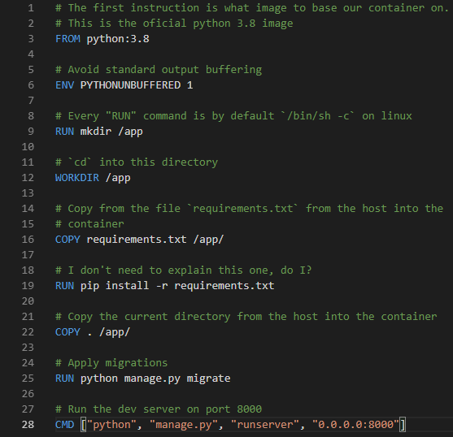

## About me
> - Daniel Kravetz 
> - Backend developer 
> - Devops 
> - Enjoy hiking with my camera  
> - Twitter [\@Av4t4r](https://twitter.com/Av4t4r)
> - Github [dkravetz](https://github.com/dkravetz)

## What is Docker?

. . .

### It's nothing more than an isolated process

## What does this mean?

> - No CPU emulation 
> - No Hypervisor 
> - It's just a process managed by the Docker service 

## Why Docker?
> - Repeatability 
> - Portability 
> - Reusability 
> - Many more 

::: notes
Repeatability: your container behaves as expected on different computers.
Portabiliy: No need to worry about other dependencies. I'll get back to this one in a minute.
Reusabilty: Shared components can be re-used.
:::

## An example use case


## We use Python...

## ...and a native C library

. . .

### which we need to configure, compile and install...

## For both MacOS and Linux {data-background-image="./img/horror.gif"}

##
### Example Dockerfile fragment

``` {.bash}
wget -O libpostal.tar.gz \ 
  https://github.com/openvenues/libpostal/archive/v1.1-alpha.tar.gz && \
  tar -xzvf libpostal.tar.gz && \
  rm -f libpostal.tar.gz && \
  ./bootstrap.sh && \
  ./configure --datadir=/usr/share/ && \
  make -j4 && \
  make install && \
  cd .. && \
  rm -fr libpostal-1.1-alpha && \
  ldconfig
```

::: notes
In order for this to work, you need to install gcc, specify a configuration directory (which can change based on the OS), etc.
:::atus=200 OK token=gD4sj7vK
Downloading artifacts for xain:frontend:build-andy-ui (330354296)...


##
### This means mantaining at least two target platforms

::: notes
This implies knowing how to deal with potential errors for different platforms, and makes distribution and deploys significantly harder than they need to be.
:::


## What are our options? {data-background-image="./img/thinking_2.gif" data-background-color="black"}

##

We tried the PEX route...

. . .

It didn't work out for us...

::: notes
This lead to huge PEX files, which anyway you needed somehow to compile the linux variant of libpostal from a Mac, and a few other troubles.
:::

## {data-background-image="./img/docker_logo.png" data-background-size="50%"}

##

> - Portability
> - Usability 
> - Fidelity 
> - No more "but it works on my machine!" 

::: notes
Portability: We can ignore the host's OS.

Usability: No need to know how to configure and compile

Fidelity: The development environment is as close as possible to production

And my favourite...
:::


## {data-background-image="./img/omg.gif" data-background-size="50%"}

##
### Let's look at a more typical scenario

##
### A Django app


::: notes
As you can see, it's the basic Hello world from Django.

So, how do you run this? Do you use `python`, `python3` or maybe `./`? How do you `pip install` (pip vs pip3)?

Maybe you are running Ubuntu while your coworkers have Mac (or viceversa)
:::

## 
### Let's dockerize it

##


::: notes
This is just 9 lines of code. Granted, this is a trivial example, but other than a `manage.py collectstatic`, this is it.

Every time you build the image, all of this steps get executed, one at a time, creating a "layer". Once the container is built, your image (think of it as class vs object) contains all the output of that `pip install`, and it runs the server.

However, this is mostly useful for an `sqlite` setup. Let's dig deeper.
:::

##


##
### Production ready Dockerfile


##


::: notes
Docker's `entrypoint` is what gets executed by default, on container start. This gets executed every time you start an image from this container.

An `entrypoint` can be **anything** that the container can execute. Bash, python, go, rust, whatever.
:::

##

~~~ {.bash .numberLines }
#!/bin/bash

python manage.py migrate
python manage.py collectstatic
python manage.py runserver $@
~~~

::: notes
As you can see, in this case, the static migrations and static files collection happens on the container startup.

This makes sense for a production environment. This will be executed in the correct environment.
:::

## Q&A/Demo

## The End

Twitter [\@Av4t4r](https://twitter.com/Av4t4r) | Github [dkravetz](https://github.com/dkravetz)